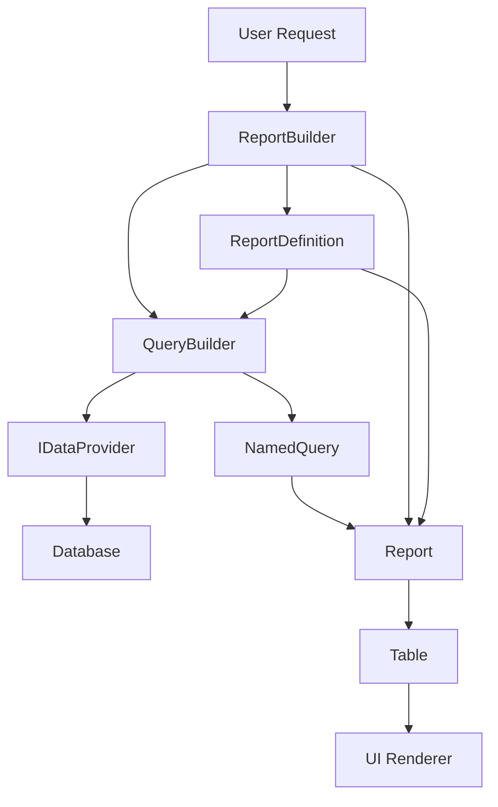
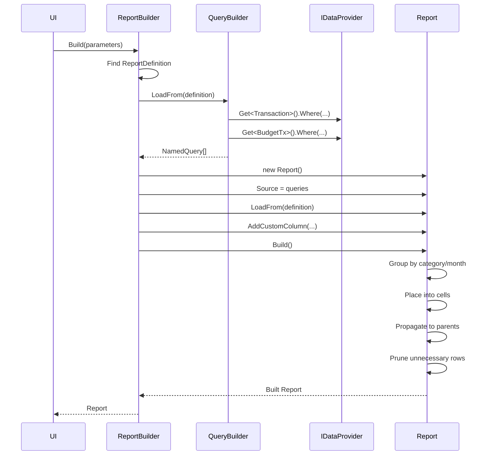
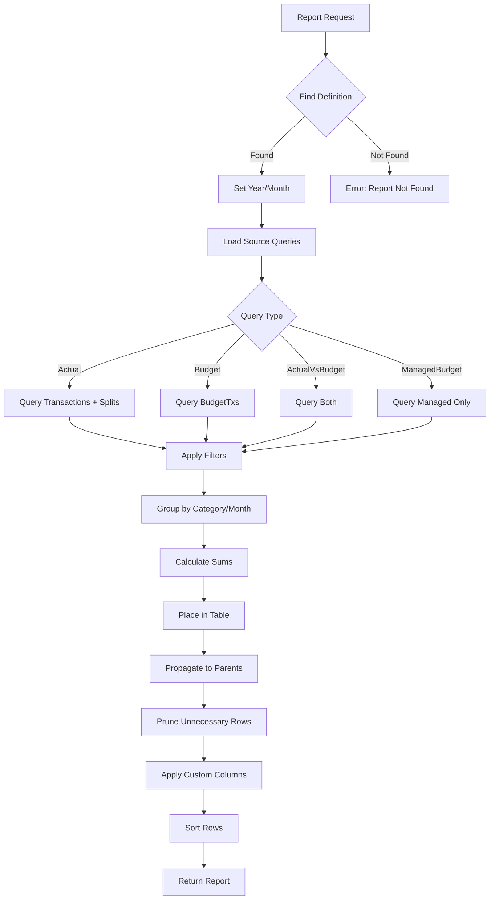

# Product Requirements Document: Budget Reports System

## Executive Summary

This document describes the budget reporting functionality in YoFi, a personal finance management system. The budget reporting system compares actual spending against budgeted amounts across hierarchical categories, supports multiple reporting frequencies (yearly, quarterly, monthly, weekly), and provides flexible visualization and analysis capabilities.

**Document Version:** 1.0  
**Last Updated:** 2025-12-23  
**Author:** System Architect

---

## Table of Contents

1. [Overview](#overview)
2. [Data Model](#data-model)
3. [Core Concepts](#core-concepts)
4. [Budget Report Types](#budget-report-types)
5. [Report Architecture](#report-architecture)
6. [User Workflows](#user-workflows)
7. [Technical Implementation](#technical-implementation)
8. [UI/UX Requirements](#uiux-requirements)
9. [Data Processing Pipeline](#data-processing-pipeline)
10. [API Requirements](#api-requirements)
11. [Testing Requirements](#testing-requirements)
12. [Appendix](#appendix)

---

## 1. Overview

### 1.1 Purpose

The budget reporting system enables users to:
- Create and maintain budgets with yearly or managed (monthly/weekly/quarterly) frequencies
- Compare actual spending against budgeted amounts
- Generate reports showing budget vs. actual spending across hierarchical categories
- Track budget progress throughout the year
- Identify spending variances and patterns

### 1.2 Key Features

- **Multiple Budget Types**: Support for yearly budgets and managed budgets with recurring frequencies
- **Hierarchical Categories**: Unlimited levels of category nesting (e.g., `Housing:Utilities:Electric`)
- **Flexible Reporting**: Five distinct budget report types with different views
- **Progress Tracking**: Year-to-date progress calculation and percentage complete
- **Category Filtering**: Include/exclude specific top-level categories from reports
- **Multiple Display Options**: Show/hide months, adjustable detail levels

---

## 2. Data Model

### 2.1 Core Entities

#### 2.1.1 BudgetTx (Budget Transaction)

Represents a budget line item for a specific category and timeframe.

**Properties:**

| Property | Type | Description |
|----------|------|-------------|
| `ID` | int | Entity Framework identity |
| `Amount` | decimal(18,2) | Budgeted amount (typically negative for expenses, positive for income) |
| `Timestamp` | DateTime | Date representing the budget period (typically Jan 1 for yearly budgets) |
| `Category` | string | Hierarchical category (colon-separated levels) |
| `Frequency` | int | How many times tracked per year: 1=Yearly, 4=Quarterly, 12=Monthly, 52=Weekly |
| `FrequencyName` | string | Human-readable frequency: "Yearly", "Quarterly", "Monthly", "Weekly" |
| `Memo` | string | Additional notes or description |
| `Selected` | bool? | Whether included in bulk operations |

**Special Features:**

- **Reportables Property**: Divides a budget item into individual reporting periods based on frequency
  - For monthly (Frequency=12): Creates 12 reportable items, one per month
  - For yearly (Frequency=1): Creates single reportable item
  - Each reportable has: `Amount/Frequency`, appropriate `Timestamp`, and same `Category`

**Example:**

```csharp
// Monthly budget item
new BudgetTx 
{ 
    Timestamp = new DateTime(2023, 1, 1),
    Amount = -12000m,  // $12,000 expense budget for year
    Category = "Housing:Mortgage",
    Frequency = 12,    // Monthly
    Memo = "Monthly mortgage budget"
}
// This creates 12 reportables of -1000m each, one for each month
```

#### 2.1.2 IReportable Interface

Common interface for items that can be included in reports.

**Properties:**

| Property | Type | Description |
|----------|------|-------------|
| `Amount` | decimal | Transaction or budget amount |
| `Timestamp` | DateTime | When the transaction/budget occurred |
| `Category` | string | Hierarchical category string |

**Implementations:**
- [`Transaction`](YoFi.Entities/Models/Transaction.cs): Actual financial transactions
- [`Split`](YoFi.Entities/Models/Split.cs): Sub-components of transactions across multiple categories
- [`BudgetTx`](YoFi.Entities/Models/BudgetTx.cs): Budget line items
- `BudgetTx.Reportable`: Individual budget periods from managed budgets

### 2.2 Category Hierarchy

Categories use colon-separated strings to represent hierarchical structure. Categories are stored and displayed identically - there is NO transformation of category names.

**Category Structure (Storage and Display are Identical):**

```
Income
Income:Salary
Income:Bonus
Housing
Housing:Mortgage
Housing:Utilities
Housing:Utilities:Electric
Housing:Utilities:Water
Food
Food:Groceries
Food:Dining
Taxes
Taxes:Federal
Taxes:State
Savings
Savings:Retirement
Savings:Emergency
[Blank]                     ← Uncategorized transactions
```

**Special Categories:**

Categories with special meanings that affect report filtering:
- **Income**: Positive amounts, represents money coming in
- **Taxes**: Negative amounts, tax payments
- **Savings**: Negative amounts, money saved/invested
- **Transfer**: Money moved between accounts (excluded from most reports)
- **Unmapped**: Transactions without categories (excluded from most reports)

**Report Scoping via Filtering (NOT Transformation):**

Reports filter which top-level categories to include, but don't change category names:

- **"All" Reports**: Show ALL categories as-is (Income, Housing, Food, Taxes, Savings)
- **"Expenses" Reports**: EXCLUDE special categories (Income, Taxes, Savings, Transfer, Unmapped), show only Housing, Food, [Blank], etc.
- **"Income" Reports**: INCLUDE only Income and its children

**Level-Based Display:**

When reports request a specific number of levels, they slice the hierarchy starting from the filtered top:

- **"Income" report with NumLevels=1**: Shows children of Income PLUS items at Income level itself
  - Example data: `Income` ($1K), `Income:Salary` ($10K), `Income:Bonus` ($2K)
  - Report shows:
    ```
    Salary    $10,000    (77%)
    Bonus     $2,000     (15%)
    -         $1,000     (8%)    ← Items at "Income" level (no subcategory)
    TOTAL     $13,000    (100%)
    ```
  
- **"Expenses" report with NumLevels=1**: Shows `Housing`, `Food`, `[BLANK]` (top-level non-special categories; uncategorized shown as `[BLANK]` to highlight warning condition)

- **"All" report with NumLevels=1**: Shows `Income`, `Housing`, `Food`, `Taxes`, `Savings`, `-` (all top-level categories)

**Parent-Only Category Display:**

Transactions at the parent level itself (without a subcategory) are displayed differently depending on context:

- **In filtered reports** (e.g., Income report): Shown as **"-"** (dash)
  - Example: Items categorized as just "Income" (not "Income:Something")
  - Represents data at the filtered parent level
  
- **In expense reports**: Uncategorized transactions shown as **"[BLANK]"**
  - Highlights warning condition requiring attention
  - User should categorize these transactions
  - Visually distinct to call out the issue

**Important:** Category names like "Housing:Mortgage" are NEVER transformed. They appear identically in storage, display, and reports. The only difference between report types is which categories are FILTERED (included/excluded) based on scope.

### 2.3 Category Collector Pattern

Special syntax `CategoryName[collection_rule]` allows a category to collect and aggregate values from sibling categories in reports with multiple data series.

**Purpose**: Budget for "miscellaneous" or "other" items in a category without creating individual budget entries for each small subcategory, while automatically tracking actual spending.

**Examples:**

- `Housing:Other[^Mortgage;Utilities]` - Collects all Housing sub-categories EXCEPT Mortgage and Utilities
- `Food:Specific[Dining;FastFood]` - Collects only Dining and FastFood from Food categories

**Collection Rules:**
- `^` prefix means "all except" (negation)
- `;` separates multiple category names
- Collection happens at the sibling level (same parent category)
- Rule matches on **exact last segment name** of category (e.g., "Amazon" ≠ "Amazon Prime")
- **Only works in series columns** (Budget, Actual, year names)
- Does NOT work in the Total column (to prevent double-counting)

#### Recommended Behavior for Reimplementation

**User Creates Budget Entry:**
```
BudgetTx:
  Category: "Housing:Other[^Mortgage;Utilities]"
  Amount: -$5000
  Frequency: 12 (monthly)
```

**What Should Happen in Report:**

1. **Budget Column**: Shows the budgeted amount for the collector
   - `Housing:Other` → -$5,000 (the explicit budget)

2. **Actual Column**: Collects actual spending from matching siblings
   - System finds all categories under `Housing:`
   - Excludes `Housing:Mortgage` and `Housing:Utilities`
   - Sums remaining categories (Insurance + Repairs + HOA, etc.)
   - `Housing:Other` → -$3,200 (collected total)

3. **Collected Categories**: Should be HIDDEN from report
   - Prevents double-counting in parent totals
   - Keeps report clean and focused
   - Detail available through drill-down or transaction views

**Ideal Report Output:**

```
Budget Data:
  Housing:Mortgage: -$30,000
  Housing:Utilities: -$4,000
  Housing:Other[^Mortgage;Utilities]: -$5,000  ← Collector budget

Actual Transactions:
  Housing:Mortgage: -$30,000
  Housing:Utilities: -$3,800
  Housing:Insurance: -$2,400  ← Will be collected
  Housing:Repairs: -$600      ← Will be collected
  Housing:HOA: -$200          ← Will be collected

Report Shows (Expenses vs Budget):
  Category              | Budget    | Actual    | % Progress | Available
  ----------------------|-----------|-----------|------------|----------
  Housing:Mortgage      | -$30,000  | -$30,000  | 100%       | $0
  Housing:Utilities     | -$4,000   | -$3,800   | 95%        | $200
  Housing:Other         | -$5,000   | -$3,200   | 64%        | $1,800
                          ^budget    ^collected from Insurance+Repairs+HOA
  ----------------------|-----------|-----------|------------|----------
  Housing (Total)       | -$39,000  | -$37,000  | 95%        | $2,000

  Note: Insurance, Repairs, and HOA are HIDDEN (collected into Other)
```

**Why Hide Collected Items:**

1. **Prevents double-counting**: If Insurance shows separately AND in Other, parent totals would be wrong
2. **Cleaner reports**: User said "I want these grouped as Other", so respect that intent
3. **Focused view**: Shows only budgeted items, making variance analysis easier
4. **Consistent totals**: Parent category totals match sum of visible children

**Implementation Requirements:**

- Mark collected categories with a flag (e.g., `IsCollected = true`)
- Exclude collected categories from report display
- Ensure collected categories DON'T propagate to parents (originals already did)
- Provide drill-down capability to see collected item details if needed

#### Where Collectors Work

**Works in reports with series columns:**
- ✅ `all-v-budget` - Has "Budget" and "Actual" series
- ✅ `expenses-v-budget` - Has "Budget" and "Actual" series
- ✅ `managed-budget` - Has "Budget" and "Actual" series
- ✅ `yoy` (year-over-year) - Has series for each year

**Does NOT work in single-series reports:**
- ❌ `budget` - No series, just budget values
- ❌ `expenses-budget` - No series, just budget values
- ❌ `all` (actual only) - Typically single series

#### Technical Note: Why "Series Columns"

A **series** is a named set of data in a multi-source report:
- The `QueryBuilder` returns multiple `NamedQuery` objects (e.g., one named "Actual", one named "Budget")
- Each becomes a separate column in the report
- Collection only happens within these named columns, not in calculated totals
- This prevents double-counting in rollup calculations

---

## 3. Core Concepts

### 3.1 Budget Types

#### 3.1.1 Yearly Budget (Frequency = 1)

- Single budget amount for entire year
- Simplest form of budgeting
- All categories aggregated annually
- Typical use: Major expenses that don't vary monthly

**Example Use Cases:**
- Annual insurance premiums
- Yearly subscriptions
- Property taxes
- Vacation budget

#### 3.1.2 Managed Budget (Frequency > 1)

- Budget divided into multiple periods throughout the year
- More granular tracking and control
- Each period independently budgeted
- Typical use: Regular recurring expenses

**Supported Frequencies:**
- **Quarterly** (Frequency = 4): Budget divided into 4 quarters
- **Monthly** (Frequency = 12): Budget divided into 12 months
- **Weekly** (Frequency = 52): Budget divided into 52 weeks

**Example Use Cases:**
- Monthly rent/mortgage
- Weekly grocery budget
- Quarterly utility estimates
- Monthly subscription services

### 3.2 Report Timeframes

#### 3.2.1 Whole Year Reports

- Show complete annual budget
- All 12 months of actual data (if available)
- Used for planning and annual review
- Parameter: `WholeYear = true`

#### 3.2.2 Year-to-Date Reports

- Show budget and actuals up to specified month
- Default behavior for most reports
- Parameter: `month = N` (1-12)
- Enables ongoing tracking throughout the year

#### 3.2.3 Year Progress Calculation

For reports with `YearProgress = true`:

1. Find the latest transaction date in actuals
2. Calculate: `YearProgress = DayOfYear / 365`
3. Display in report description (e.g., "For 2023 through June 50%")
4. Used to contextualize budget vs. actual comparisons

### 3.3 Report Levels and Hierarchy

#### 3.3.1 Level System

Categories naturally form hierarchical levels:

- **Level 0**: Leaf categories (no children) - e.g., `Housing:Utilities:Electric`
- **Level 1**: Parent of Level 0 - e.g., `Housing:Utilities`
- **Level 2**: Grandparent - e.g., `Housing`
- **Total Row**: Top-level aggregation

#### 3.3.2 Level Control Parameters

- **`NumLevels`**: How many levels to display (1 = most aggregated, higher = more detail)
- **`SkipLevels`**: How many top levels to skip before displaying
- **`DisplayLevelAdjustment`**: Visual formatting adjustment for display

**Example:**

```
Category: "Housing:Utilities:Electric"
With SkipLevels=1, NumLevels=2:
  - Shows "Utilities:Electric" grouped under "Utilities"
  - "Housing" level is skipped
```

### 3.4 Signing Conventions

#### 3.4.1 Amount Signs

- **Positive amounts**: Income (money coming in)
- **Negative amounts**: Expenses, Taxes, Savings (money going out)

#### 3.4.2 Multi-Signed Reports

Reports containing both income and expenses are marked `IsMultiSigned = true`:
- "All" reports showing all categories
- Budget reports without category filters
- Summary reports combining income and expenses

### 3.5 Row Inclusion Rules

A critical aspect of budget reports is understanding **which categories appear in the final report**. This varies by report type and directly impacts how users interpret their data.

#### 3.5.1 Category Visibility Matrix

| Report Type | Shows categories with budget only? | Shows categories with actuals only? | Shows categories with neither? |
|-------------|-----------------------------------|-------------------------------------|-------------------------------|
| **budget** | ✅ Yes | ❌ No | ❌ No |
| **expenses-budget** | ✅ Yes | ❌ No | ❌ No |
| **all-v-budget** | ✅ Yes | ✅ Yes (with $0 budget) | ❌ No |
| **expenses-v-budget** | ✅ Yes | ✅ Yes (with $0 budget) | ❌ No |
| **managed-budget** | ✅ Yes (only Frequency > 1) | ❌ No (pruned out) | ❌ No |

#### 3.5.2 Union Behavior (Budget vs. Actual Reports)

For reports comparing budget vs. actual (all-v-budget, expenses-v-budget):

**The report shows the UNION of budgeted and actual categories:**

- **Category with budget AND actuals**: Shows both values
- **Category with budget but NO actuals**: Shows budget value, $0 for actual
- **Category with actuals but NO budget**: Shows actual value, $0 for budget
- **Category with NEITHER**: Does not appear

**Example:**

```
Budget Data:
  - Housing:Mortgage: -$30,000
  - Food:Groceries: -$12,000

Actual Data:
  - Housing:Mortgage: -$30,000
  - Food:Groceries: -$9,800
  - Entertainment:Streaming: -$600 (NO BUDGET)

Report Shows:
  Housing:Mortgage    Budget: -$30,000   Actual: -$30,000
  Food:Groceries      Budget: -$12,000   Actual: -$9,800
  Entertainment:Streaming  Budget: $0    Actual: -$600    ← Appears despite no budget
```

**Rationale**: This design helps users identify unbudgeted spending, which is critical for budget management.

#### 3.5.3 Budget-Only Reports

For reports showing only budget data (budget, expenses-budget):

**The report shows ONLY categories that have budget entries:**

- Categories must exist in BudgetTxs table for the specified year
- No intersection with actual transactions
- Useful for planning and budget review

**Example:**

```
Budget Data:
  - Housing:Mortgage: -$30,000
  - Food:Groceries: -$12,000

Actual Data:
  - Housing:Mortgage: -$30,000
  - Food:Groceries: -$9,800
  - Entertainment:Streaming: -$600

Report Shows:
  Housing:Mortgage    -$30,000
  Food:Groceries      -$12,000
  (Entertainment:Streaming does NOT appear - no budget entry)
```

#### 3.5.4 Managed Budget Report (Special Case)

The managed-budget report has unique pruning behavior:

**Shows ONLY categories where:**
1. BudgetTx.Frequency > 1 (monthly, weekly, quarterly)
2. AND that category has actual transaction data

**Technical Implementation:**
- Budget query is processed FIRST with `LeafRowsOnly = true`
- This marks the Budget series column as a "leaf nodes only" series
- During pruning phase, rows with zero in leaf-nodes-only columns are removed
- This means: If no managed budget exists for a category, that category is pruned even if it has actuals

**Example:**

```
Budget Data:
  - Food:Groceries (Frequency=12): -$12,000  ← Managed
  - Insurance (Frequency=1): -$5,000         ← Yearly, NOT managed

Actual Data:
  - Food:Groceries: -$9,800
  - Insurance: -$4,800

Report Shows:
  Food:Groceries    Budget: -$12,000   Actual: -$9,800
  (Insurance does NOT appear - not a managed budget despite having actuals)
```

**Edge Case - No Managed Budgets:**

If there are NO budget items with Frequency > 1:
- Report table is not rendered at all
- Empty state message displayed: "There is no data to display"
- User prompted to create managed budget items

---

## 4. Budget Report Types

### 4.1 Budget Report (`slug: "budget"`)

**Purpose**: View complete annual budget across all categories

**Configuration:**
```csharp
{
    slug = "budget",
    Name = "Full Budget",
    Source = "Budget",
    WholeYear = true,
    NumLevels = 2
}
```

**Characteristics:**
- Shows only budget amounts (no actuals)
- Whole year view regardless of current month
- 2 levels of category detail
- Single "Budget" column
- Includes all categories: Income, Expenses, Taxes, Savings

**Use Cases:**
- Annual budget planning
- Budget review and adjustments
- Export budget for external analysis
- Documentation for year-end records

**Expected Output:**

| Category | Total |
|----------|-------|
| Income | $85,000 |
| Income:Salary | $80,000 |
| Income:Bonus | $5,000 |
| Expenses | ($60,000) |
| Expenses:Housing | ($30,000) |
| Expenses:Food | ($12,000) |
| ... | ... |
| **TOTAL** | **$25,000** |

---

### 4.2 Expenses Budget Report (`slug: "expenses-budget"`)

**Purpose**: View budgeted expenses only, excluding Income, Taxes, and Savings

**Configuration:**
```csharp
{
    slug = "expenses-budget",
    Source = "Budget",
    SourceParameters = "excluded=Savings,Taxes,Income,Transfer,Unmapped",
    WholeYear = true,
    NumLevels = 2,
    Name = "Expenses Budget"
}
```

**Characteristics:**
- Budget amounts only (no actuals)
- Excludes: Savings, Taxes, Income, Transfer, Unmapped
- Focuses on regular spending categories
- 2 levels of detail

**Use Cases:**
- Expense planning
- Non-discretionary vs discretionary spending analysis
- Comparison against previous year's expenses
- Monthly expense tracking baseline

---

### 4.3 All vs Budget Report (`slug: "all-v-budget"`)

**Purpose**: Compare actual spending against budget across ALL categories

**Configuration:**
```csharp
{
    slug = "all-v-budget",
    Name = "All vs. Budget",
    Source = "ActualVsBudget",
    WholeYear = true,
    WithTotalColumn = false,
    NumLevels = 2,
    CustomColumns = "budgetpct"
}
```

**Characteristics:**
- Shows both "Budget" and "Actual" columns
- Includes "% Progress" custom column
- No total column (replaced by named columns)
- Covers entire year
- Includes all categories

**Custom Columns:**
- **% Progress**: `Actual / Budget` ratio
  - Shows percentage of budget consumed
  - Capped at 1000% for outliers (when actual > 10x budget)
  - 0% when budget is zero

**Expected Output:**

| Category | Budget | Actual | % Progress |
|----------|--------|--------|------------|
| Income | $85,000 | $82,500 | 97% |
| Expenses | ($60,000) | ($58,200) | 97% |
| Expenses:Housing | ($30,000) | ($30,000) | 100% |
| Expenses:Food | ($12,000) | ($9,800) | 82% |
| Taxes | ($15,000) | ($14,000) | 93% |
| Savings | ($10,000) | ($12,000) | 120% |
| **TOTAL** | **($0)** | **($1,700)** | **-** |

---

### 4.4 Expenses vs Budget Report (`slug: "expenses-v-budget"`)

**Purpose**: Compare actual expenses against budgeted expenses with progress tracking

**Configuration:**
```csharp
{
    slug = "expenses-v-budget",
    Name = "Expenses vs. Budget",
    Source = "ActualVsBudget",
    SourceParameters = "excluded=Savings,Taxes,Income,Transfer,Unmapped",
    WholeYear = true,
    YearProgress = true,
    CustomColumns = "budgetpct,budgetavailable",
    WithTotalColumn = false,
    NumLevels = 2
}
```

**Characteristics:**
- Focus on expenses only
- Shows year progress percentage in description
- Three custom columns: % Progress and Available
- No total column
- Excludes: Savings, Taxes, Income, Transfer, Unmapped

**Custom Columns:**
- **% Progress**: `Actual / Budget` percentage
- **Available**: `Actual - Budget` (how much budget remains)
  - Positive = under budget (good for expenses)
  - Negative = over budget (concerning)

**Expected Output:**

| Category | Budget | Actual | % Progress | Available |
|----------|--------|--------|------------|-----------|
| Housing | ($30,000) | ($30,000) | 100% | $0 |
| Food | ($12,000) | ($9,800) | 82% | $2,200 |
| Transportation | ($8,000) | ($9,200) | 115% | ($1,200) |
| Utilities | ($4,000) | ($3,500) | 88% | $500 |
| Entertainment | ($6,000) | ($5,700) | 95% | $300 |
| **TOTAL** | **($60,000)** | **($58,200)** | **97%** | **$1,800** |

**Year Progress Note:**
Description shows: "For 2023 through June 50%" indicating we're halfway through the year.

---

### 4.5 Managed Budget Report (`slug: "managed-budget"`)

**Purpose**: View only managed budgets (monthly/weekly) with actual spending comparison

**Configuration:**
```csharp
{
    slug = "managed-budget",
    Name = "Managed Budget",
    Source = "ManagedBudget",
    WithTotalColumn = false,
    NumLevels = 4,
    DisplayLevelAdjustment = 1,
    SortOrder = "NameAscending",
    CustomColumns = "budgetpct,budgetavailable"
}
```

**Characteristics:**
- Shows ONLY categories with Frequency > 1
- Higher detail level (up to 4 levels)
- Sorted alphabetically by name
- Includes Budget, Actual, % Progress, and Available columns
- May include collector categories for grouping

**Special Behavior:**
- If no managed budgets exist, report is completely blank
- Useful for granular monthly/weekly tracking
- Often used for high-priority spending categories

**Expected Output:**

| Category | Budget | Actual | % Progress | Available |
|----------|--------|--------|------------|-----------|
| Food:Groceries | ($800) | ($750) | 94% | $50 |
| Food:Dining | ($400) | ($380) | 95% | $20 |
| Income:Salary | $7,000 | $7,000 | 100% | $0 |
| Utilities:Electric | ($150) | ($145) | 97% | $5 |
| Utilities:Gas | ($80) | ($75) | 94% | $5 |
| Utilities:Water | ($60) | ($55) | 92% | $5 |

**No Data Scenario:**
When no managed budgets exist:
- Report table not rendered
- "There is no data to display" message shown
- User prompted to create managed budget items

---

## 5. Report Architecture

### 5.1 Component Overview



### 5.2 Key Components

#### 5.2.1 [`ReportBuilder`](YoFi.Core/Reports/ReportBuilder.cs)

**Responsibility**: Top-level entry point for building reports

**Key Methods:**
- `Build(ReportParameters)`: Creates a single report based on parameters
- `BuildSummary(ReportParameters)`: Creates multi-report summary view
- `CustomColumnFor(string)`: Defines custom calculated columns

**Features:**
- Loads report definitions
- Manages year/month parameters
- Adds custom columns
- Handles special report types (yoy, summary)
- Contains static list of all report definitions

#### 5.2.2 [`QueryBuilder`](YoFi.Core/Reports/QueryBuilder.cs)

**Responsibility**: Builds Entity Framework queries for different report scenarios

**Key Methods:**
- `QueryActual()`: Query actual transactions and splits
- `QueryBudget()`: Query budget line items
- `QueryActualVsBudget()`: Combine actual and budget queries
- `QueryManagedBudget()`: Query only managed budget items
- `QueryYearOverYear()`: Query multiple years for comparison

**Query Types:**

1. **Actual Queries**
   - Combines transactions without splits + all splits
   - Filters by year and month
   - Excludes hidden transactions
   - Can filter by top category or excluded categories

2. **Budget Queries**
   - Filters budget items by year
   - Can exclude specific top categories
   - Returns as IReportable

3. **Managed Budget Queries**
   - Filters to Frequency > 1
   - Expands into individual reportables
   - Only includes periods up to current month
   - Sets `LeafRowsOnly = true`

4. **Actual vs Budget Queries**
   - Returns multiple named queries
   - One for "Actual" (from transactions/splits)
   - One for "Budget" (from budget items)
   - Can be leaf-rows-only for exports

#### 5.2.3 [`Report`](YoFi.Core/Reports/Report.cs)

**Responsibility**: Arranges IReportable items into tables with rows/columns

**Configuration Properties:**
- `Name`: Display name
- `Description`: Timeframe description
- `Source`: IEnumerable<NamedQuery> of data sources
- `WithMonthColumns`: Show individual months
- `WithTotalColumn`: Show total column
- `NumLevels`: Depth to display
- `SkipLevels`: Levels to skip from top
- `SortOrder`: NameAscending, TotalAscending, TotalDescending

**Build Process (4 Phases):**

1. **Group Phase**: Group reportables by category and month, calculate sums
2. **Place Phase**: Put values into correct table cells
3. **Propagate Phase**: Roll up values to parent categories
4. **Prune Phase**: Remove unnecessary rows

**Custom Columns:**
- Calculated columns using lambda functions
- Access to all other columns in same row
- Can reference grand total
- Support percentage display format

**Slicing Methods:**
- `TakeSlice(rowname)`: Extract portion of report for one top category
- `TakeSliceExcept(rownames)`: Extract portion excluding categories
- `PruneToLevel(newlevel)`: Remove detail levels

#### 5.2.4 [`NamedQuery`](YoFi.Core/Reports/NamedQuery.cs)

**Responsibility**: Wrapper for IQueryable<IReportable> with metadata

**Properties:**
- `Query`: The actual EF Core query
- `Name`: Series name for multi-series reports (e.g., "Actual", "Budget")
- `LeafRowsOnly`: Don't propagate to parent totals
- `IsMultiSigned`: Contains both positive and negative amounts

**Methods:**
- `Labeled(newname)`: Create copy with different name
- `AsLeafRowsOnly(bool)`: Create copy with leaf-only setting

#### 5.2.5 [`ReportDefinition`](YoFi.Core/Reports/ReportDefinition.cs)

**Responsibility**: Data-only definition of a report type

**Properties:**

| Section | Property | Description |
|---------|----------|-------------|
| Identity | `slug` | URL-friendly identifier |
| Identity | `Name` | Display name |
| QueryBuilder | `Source` | Query source name ("Actual", "Budget", etc.) |
| QueryBuilder | `SourceParameters` | Filter parameters (top=X, excluded=X,Y,Z) |
| ReportBuilder | `CustomColumns` | Comma-separated custom column names |
| ReportBuilder | `WholeYear` | Use all 12 months regardless of month param |
| ReportBuilder | `YearProgress` | Show year progress percentage |
| Report | `SortOrder` | Sorting method |
| Report | `WithMonthColumns` | Show individual month columns |
| Report | `WithTotalColumn` | Show total column |
| Report | `SkipLevels` | Levels to skip from top |
| Report | `NumLevels` | Number of levels to display |
| Report | `DisplayLevelAdjustment` | Visual level adjustment |

#### 5.2.6 [`Table<TColumn, TRow, TValue>`](YoFi.Core/Reports/Table.cs)

**Responsibility**: Generic 2D table structure storing report data

**Features:**
- Dictionary-based storage: `(column, row) -> value`
- Maintains sets of row and column labels
- Efficient lookup and update
- Supports custom comparer for sorting

### 5.3 Report Generation Flow



---

## 6. User Workflows

### 6.1 Creating a Budget

**Primary Flow:**

1. Navigate to Budget Txs page (Edit Budget button from Budget page)
2. Click "Create New"
3. Enter budget details:
   - Amount (negative for expenses, positive for income)
   - Date (typically Jan 1 for yearly budgets)
   - Category (hierarchical with colons)
   - Frequency (Yearly, Quarterly, Monthly, Weekly)
   - Memo (optional notes)
4. Click "Create"
5. Budget appears in list

**Bulk Import Flow:**

1. Navigate to Budget Txs page
2. Click "Upload"
3. Select XLSX file with budget data
4. System imports all budget items
5. Review imported items

**Expected Budget Structure (XLSX):**

| Timestamp | Amount | Category | Frequency | Memo |
|-----------|--------|----------|-----------|------|
| 2023-01-01 | -30000 | Housing:Mortgage | 12 | Monthly mortgage |
| 2023-01-01 | -12000 | Food:Groceries | 12 | Weekly groceries |
| 2023-01-01 | -5000 | Utilities | 1 | Annual utilities |

### 6.2 Viewing Budget Reports

**Budget Summary Page Flow:**

1. Navigate to Budget page
2. System automatically loads "Expenses vs Budget" report
3. Loading spinner displays during report generation
4. Report rendered with:
   - Budget amounts
   - Actual spending
   - % Progress
   - Available budget

**Report Parameters:**

- **Year selector**: Dropdown in navbar (2017-current year)
- **URL parameters**: `?year=2023&month=6&level=2&showmonths=true`

**Navigation:**

- Budget page → Auto-loads expenses-v-budget
- Reports page → Links to all report types
- Actions menu → "Edit Budget" button

### 6.3 Editing Budget Items

**Single Edit Flow:**

1. Navigate to Budget Txs index
2. Click "Edit" next to budget item
3. Modify fields (amount, category, frequency, etc.)
4. Click "Save"
5. Changes reflected in reports

**Bulk Operations:**

1. Click "Show Selection" toggle
2. Check items to modify
3. Click "Bulk Delete"
4. Confirm deletion
5. Selected items removed

### 6.4 Analyzing Budget Performance

**Identifying Over-Budget Categories:**

1. View "Expenses vs Budget" report
2. Look for "Available" column negative values (over budget)
3. Look for "% Progress" > 100%
4. Sort by total to find largest variances

**Comparing Managed Budgets:**

1. Navigate to managed-budget report
2. Review monthly/weekly categories
3. Compare against actual spending
4. Identify categories needing adjustment

**Year-over-Year Analysis:**

1. View budget report for current year
2. Change year selector to previous year
3. Compare total budgets
4. Note category changes

---

## 7. Technical Implementation

### 7.1 Database Schema

**BudgetTxs Table:**

```sql
CREATE TABLE [BudgetTxs] (
    [ID] int IDENTITY(1,1) PRIMARY KEY,
    [Amount] decimal(18,2) NOT NULL,
    [Timestamp] datetime2 NOT NULL,
    [Category] nvarchar(max) NULL,
    [Frequency] int NOT NULL DEFAULT 1,
    [Memo] nvarchar(max) NULL,
    [Selected] bit NULL
)

-- Indexes
CREATE INDEX [IX_BudgetTxs_Timestamp] ON [BudgetTxs]([Timestamp])
CREATE INDEX [IX_BudgetTxs_Category] ON [BudgetTxs]([Category])
```

**Related Tables:**
- **Transactions**: Actual transactions
- **Split**: Sub-components of transactions

### 7.2 Entity Framework Queries

**Example: Query Budget Items for Year**

```csharp
var budgetItems = context.BudgetTxs
    .Where(x => x.Timestamp.Year == year)
    .AsQueryable();
```

**Example: Query Managed Budget Items**

```csharp
var managed = context.BudgetTxs
    .Where(x => x.Timestamp.Year == year)
    .Where(x => x.Frequency > 1)
    .AsEnumerable()
    .SelectMany(x => x.Reportables
        .Where(r => r.Timestamp.Month <= month))
    .AsQueryable();
```

**Example: Query Actual vs Budget**

```csharp
// Actual
var actual = context.Transactions
    .Where(x => x.Timestamp.Year == year 
        && x.Timestamp.Month <= month 
        && x.Hidden != true)
    .Where(x => !x.Splits.Any());

// Budget
var budget = context.BudgetTxs
    .Where(x => x.Timestamp.Year == year);

// Combine
var queries = new[] {
    new NamedQuery { Name = "Actual", Query = actual },
    new NamedQuery { Name = "Budget", Query = budget }
};
```

### 7.3 Category Processing

**Category Parsing:**

```csharp
// Split category into levels
var levels = category.Split(':');

// Top-level category
var topLevel = levels.First();

// Full hierarchy
var hierarchy = new List<string>();
for (int i = 0; i < levels.Length; i++)
{
    hierarchy.Add(string.Join(':', levels.Take(i + 1)));
}
// Result: ["Housing", "Housing:Utilities", "Housing:Utilities:Electric"]
```

**Category Filtering:**

```csharp
// Exclude top categories
var excluded = new[] { "Savings", "Taxes", "Income" };
var filtered = items.Where(x => 
    !excluded.Contains(x.Category) &&
    !excluded.Any(e => x.Category?.StartsWith($"{e}:") ?? false));
```

**Collector Pattern Processing:**

```csharp
// Pattern: "Category[^Excluded1;Excluded2]"
var regex = new Regex(@"(.+?)\[(.+?)\]");
var match = regex.Match(categoryString);

if (match.Success)
{
    var categoryName = match.Groups[1].Value;
    var rule = match.Groups[2].Value;
    var isNegation = rule.StartsWith('^');
    var categories = rule.TrimStart('^').Split(';');
    
    // Collect from matching siblings
}
```

### 7.4 Custom Column Calculations

**Budget Percentage:**

```csharp
new ColumnLabel
{
    Name = "% Progress",
    DisplayAsPercent = true,
    Custom = (cols) =>
    {
        var budget = cols.GetValueOrDefault("ID:Budget");
        var actual = cols.GetValueOrDefault("ID:Actual");
        
        if (budget == 0 || Math.Abs(actual / budget) > 10m)
            return 0;
            
        return actual / budget;
    }
}
```

**Budget Available:**

```csharp
new ColumnLabel
{
    Name = "Available",
    Custom = (cols) =>
        cols.GetValueOrDefault("ID:Actual") - 
        cols.GetValueOrDefault("ID:Budget")
}
```

**Percent of Total:**

```csharp
new ColumnLabel
{
    Name = "% Total",
    DisplayAsPercent = true,
    Custom = (cols) =>
    {
        var grandTotal = cols.GetValueOrDefault("GRANDTOTAL");
        var total = cols.GetValueOrDefault("TOTAL");
        
        return grandTotal == 0 ? 0 : total / grandTotal;
    }
}
```

### 7.5 Performance Considerations

**Query Optimization:**

1. **Push calculations to database**: Use IQueryable throughout pipeline
2. **Group before fetching**: GroupBy in database, not memory
3. **Minimize data transfer**: Select only needed fields early
4. **Index critical columns**: Timestamp, Category for filtering

**Caching Strategy:**

- Report definitions: Static, cached in memory
- Month column labels: Pre-calculated dictionary
- Query results: Not cached (data changes frequently)

**Lazy Loading:**

- Reports loaded via AJAX on Budget page
- Progressive rendering: Show spinner, then replace with content
- Allows page to load quickly while report generates

### 7.6 Known Issues in Current Implementation

#### 7.6.1 Collector Pattern Depth Calculation Bug

**Issue Summary:** The collector pattern has a depth-matching bug that prevents collection from working correctly at certain category hierarchy depths.

**Root Cause:** Inconsistent depth calculation between collector indexing and lookup phases in [`Report.cs`](YoFi.Core/Reports/Report.cs:490).

**Technical Details:**

1. **Line 490 - Indexing Phase**: Collectors are indexed by counting colons in the **collector row's UniqueID** (which includes trailing colon)
   ```csharp
   var depth = row.UniqueID.Count(x => x == ':');
   CollectorRows[depth][parentid] = row;
   ```

2. **Line 648 - Lookup Phase**: Collectors are looked up by counting colons in the **current row's parent ID** (no trailing colon)
   ```csharp
   var depth = 1 + parentid.Count(x => x == ':');
   var collectorRow = CollectorRows.GetValueOrDefault(depth)?.GetValueOrDefault(parentid);
   ```

3. **The Mismatch**: These two calculations use different reference points, creating an off-by-one error

**Example Failure Scenario:**

```
User creates budget:
  Category: "Housing:Home Goods:Monthly[^Christmas Books;Holiday;Amazon Prime]"
  
Indexing (Line 490):
  UniqueID: "Housing:Home Goods:Monthly:" (3 colons with trailing colon)
  Stored at: CollectorRows[3]["Housing:Home Goods"]

Actual transaction:
  Category: "Housing:Home Goods:Amazon"
  Parent: "Housing:Home Goods" (1 colon, no trailing colon)
  
Lookup (Line 648):
  depth = 1 + 1 = 2
  Looks up: CollectorRows[2]["Housing:Home Goods"]
  Result: MISS - Collector not found at depth 2, exists at depth 3
  
Outcome: Collection does not happen, "Amazon" not collected into "Monthly"
```

**Example Working Scenario:**

```
User creates budget:
  Category: "Housing:Other[^Mortgage;Utilities]"
  
Indexing (Line 490):
  UniqueID: "Housing:Other:" (2 colons with trailing colon)
  Stored at: CollectorRows[2]["Housing"]

Actual transaction:
  Category: "Housing:Insurance"
  Parent: "Housing" (0 colons)
  
Lookup (Line 648):
  depth = 1 + 0 = 1
  Looks up: CollectorRows[1]["Housing"]
  Result: Different mismatch due to category structure
  
Note: This case may work due to other factors in the category hierarchy structure
```

**Impact:**

- Collectors work unreliably depending on category depth
- Deeper hierarchies (3+ levels) more likely to fail
- Shallow collectors (2 levels) may work in some cases
- User confusion when collection works in some categories but not others

**Workaround:**

Use collectors at shallower category depths (1-2 levels instead of 3+):
- ✅ Works: `Housing:Other[^Mortgage;Utilities]`
- ❌ Fails: `Housing:Home Goods:Monthly[^Christmas Books;Holiday]`

**Recommended Fix:**

Change line 648 to use consistent depth calculation:

```csharp
// CURRENT (incorrect):
var depth = 1 + parentid.Count(x => x == ':');

// FIXED:
var depth = row.UniqueID.Count(x => x == ':');
```

This makes both indexing and lookup use the same reference point (the row's UniqueID), eliminating the off-by-one mismatch.

**Testing Requirements:**

After fix, verify:
1. Collectors work at all hierarchy depths (2, 3, 4+ levels)
2. Collection happens correctly for both inclusion and exclusion rules
3. Existing shallow collectors continue to work
4. Edge cases: single-level collectors, deep hierarchies (5+ levels)

#### 7.6.2 Collected Categories Visibility Issue

**Issue Summary:** When a collector category aggregates sibling categories, both the individual categories AND the collector appear in the report, causing potential double-counting in parent totals.

**Current Behavior:**

```
Budget: Housing:Other[^Mortgage;Utilities] = -$5,000
Actuals:
  Housing:Mortgage = -$30,000
  Housing:Insurance = -$2,400
  Housing:Repairs = -$600

Report Shows:
  Housing:Mortgage:    -$30,000
  Housing:Insurance:   -$2,400  ← Appears individually
  Housing:Repairs:     -$600    ← Appears individually
  Housing:Other:       -$3,000  ← ALSO appears (collected from Insurance+Repairs)
  ---
  Housing Total:       -$36,000 ← Double-counts Insurance and Repairs!
```

**Root Cause:**

- Collection is additive - collected items are not marked as "consumed"
- No mechanism to hide collected categories from display
- Standard propagation adds both individual items AND collector to parent totals

**Recommended Design:**

Collected categories should be HIDDEN from report display:

```
Report Should Show:
  Housing:Mortgage:    -$30,000
  Housing:Other:       -$3,000  ← Collected from Insurance+Repairs
  ---
  Housing Total:       -$33,000 ← Correct total (no double-counting)
  
  Note: Insurance and Repairs are hidden (detail available via drill-down)
```

**Benefits of Hiding:**

1. **Prevents double-counting**: Parent totals remain accurate
2. **Cleaner reports**: Shows only budgeted categories
3. **Respects user intent**: User said "group these as Other"
4. **Consistent totals**: Parent equals sum of visible children

**Implementation Requirements:**

1. Mark collected categories with flag (e.g., `IsCollected = true`)
2. Exclude collected categories during report display rendering
3. Prevent collected categories from propagating to parents (their values already propagated before collection)
4. Optionally provide drill-down UI to see collected item details

---

## 8. UI/UX Requirements

### 8.1 Budget Txs Index Page

**Layout:**
- Table view of all budget items
- Columns: Date, Category, Amount, Frequency, Memo, Actions
- Pagination support
- Search/filter capability

**Actions:**
- Create New
- Edit (per item)
- Delete (per item)
- Bulk Delete (selected items)
- Upload (XLSX import)
- Download (XLSX export)
- Show/Hide Selection checkboxes

**Visual Cues:**
- Negative amounts in red (expenses)
- Positive amounts in green (income)
- Frequency badge (Yearly, Monthly, etc.)
- Category hierarchy indentation

### 8.2 Budget Summary Page

**Header:**
- Title: "Budget Summary"
- Year selector dropdown
- Actions menu (Edit Budget)

**Content:**
- Auto-loaded "Expenses vs Budget" report
- Loading spinner during generation
- Report table with:
  - Category column (left-aligned, hierarchical)
  - Budget column (right-aligned, currency)
  - Actual column (right-aligned, currency)
  - % Progress column (right-aligned, percentage)
  - Available column (right-aligned, currency)

**Interactive Elements:**
- Year selector: Changes URL parameter and reloads
- Category rows: Hierarchical indentation
- Total row: Bold, separated by border
- Responsive layout: Hides columns on mobile

### 8.3 Report Display Template

**Standard Report Structure:**

```html
<div class="report" data-test-id="report-{slug}">
    <h2>{Report Name}</h2>
    <p class="description">{Description with timeframe}</p>
    
    <table class="report-table">
        <thead>
            <tr>
                <th class="category-col">Category</th>
                <th class="numeric-col" *ngFor="column">
                    {Column Name}
                </th>
            </tr>
        </thead>
        <tbody>
            <tr *ngFor="row" [class.report-row-{level}]>
                <td class="category-cell" 
                    [style.padding-left]="{level * 20}px">
                    {Row Name}
                </td>
                <td class="numeric-cell" *ngFor="column">
                    {Cell Value}
                </td>
            </tr>
            <tr class="total-row">
                <td><strong>TOTAL</strong></td>
                <td *ngFor="column">
                    <strong>{Total Value}</strong>
                </td>
            </tr>
        </tbody>
    </table>
</div>
```

**CSS Classes:**
- `.report-row-0`: Leaf categories (most detailed)
- `.report-row-1`: Level 1 parent categories
- `.report-row-2`: Level 2 grandparent categories
- `.total-row`: Total row styling
- `.category-cell`: Left-aligned text
- `.numeric-cell`: Right-aligned numbers

**Responsive Behavior:**
- Mobile: Show only highest priority columns
- Tablet: Show priority 1-2 columns
- Desktop: Show all columns
- Print: Optimize for paper layout

### 8.4 Empty State Handling

**No Budget Items:**
```html
<div class="empty-state">
    <p>No budget items found.</p>
    <a href="/BudgetTxs/Create" class="btn">Create Budget</a>
</div>
```

**No Managed Budgets:**
```html
<div data-test-id="no-data">
    <p>There is no data to display.</p>
    <p>Create managed budget items (monthly or weekly) to see this report.</p>
</div>
```

**No Matching Data:**
```html
<div class="empty-state">
    <p>No data found for selected timeframe.</p>
    <a href="?year={previous}" class="btn">View Previous Year</a>
</div>
```

---

## 9. Data Processing Pipeline

### 9.1 Report Generation Pipeline



### 9.2 Category Propagation Algorithm

**Purpose**: Roll up values from child categories to parent totals

**Algorithm:**

```
For each reportable item:
    1. Determine category hierarchy
       e.g., "Housing:Utilities:Electric" -> ["Housing", "Housing:Utilities", "Housing:Utilities:Electric"]
    
    2. Place value in leaf category
       Table[column]["Housing:Utilities:Electric"] += amount
    
    3. For each parent in hierarchy (bottom-up):
       a. Find or create parent row
       b. Add value to parent
          Table[column]["Housing:Utilities"] += amount
          Table[column]["Housing"] += amount
       c. Set child.Parent = parent
       d. Calculate child.Level = parent.Level - 1
    
    4. When reaching top level (no more parents):
       a. Add to grand total
          Table[column][TotalRow] += amount
       b. Set Level = NumLevels - 1
```

**Example:**

```
Input: $100 in "Housing:Utilities:Electric"

After propagation:
  Housing:Utilities:Electric: $100 (Level 0)
  Housing:Utilities: $100 (Level 1, parent of Electric)
  Housing: $100 (Level 2, parent of Utilities)
  TOTAL: $100 (Total row)
```

### 9.3 Collector Category Processing

**Purpose**: Aggregate sibling categories based on rules

**Algorithm:**

```
For each category matching pattern "Name[rule]":
    1. Parse rule:
       - Extract category name before '['
       - Extract rule inside '[]'
       - Check for '^' negation prefix
       - Split on ';' for multiple categories
    
    2. Find parent category:
       - Parent = everything before last ':'
       - e.g., "Housing:Other[^Mortgage]" -> parent is "Housing"
    
    3. Find sibling categories under same parent
    
    4. For each sibling:
       If (sibling matches rule) XOR (rule is negated):
           Collect value into collector category
    
    5. Add collected values to series column only
       (Not total column, to avoid double-counting)
```

**Example:**

```
Categories under "Housing":
  - Housing:Mortgage: $2000
  - Housing:Utilities: $300
  - Housing:Insurance: $200
  - Housing:Maintenance: $150
  - Housing:Other[^Mortgage;Utilities]

Collector processes:
  Rule: "^Mortgage;Utilities" (negation)
  Collects: Insurance ($200) + Maintenance ($150) = $350
  
Result:
  Housing:Other appears in "Actual" column with $350
```

### 9.4 Pruning Logic

**Purpose**: Remove unnecessary or duplicate rows

**Rules:**

1. **Duplicate Leaf Removal**:
   - If category ends with ':' (e.g., "Housing:")
   - AND has same value as parent without ':'
   - AND has no other children
   - Then remove the ':' version

2. **Level-Based Pruning**:
   - If row.Level < 0 (below NumLevels cutoff)
   - Then remove row

3. **Leaf-Only Pruning**:
   - If any series column is LeafNodesOnly
   - AND row has no value in that series
   - Then remove row
   - Flatten remaining rows (Level = 0, Parent = null)

**Example:**

```
Before pruning:
  Housing (Level 2): $2500
  Housing: (Level 1): $2500  <- Duplicate
  Housing:Utilities (Level 1): $300
  Housing:Utilities: (Level 0): $300  <- Duplicate

After pruning:
  Housing (Level 2): $2500
  Housing:Utilities (Level 1): $300
```

---

## 10. API Requirements

### 10.1 REST Endpoints

**Get Report (JSON):**

```
GET /api/report/{slug}?year={year}&month={month}&level={level}

Response:
{
  "name": "Expenses vs. Budget",
  "description": "For 2023 through June",
  "rows": [
    {
      "name": "Housing",
      "id": "Housing:",
      "isTotal": false,
      "level": 1,
      "Budget": -30000,
      "Actual": -30000,
      "% Progress": 1.0,
      "Available": 0
    },
    ...
  ]
}
```

**Get Report (HTML Partial):**

```
GET /ReportPartial?slug={slug}&year={year}&month={month}

Response: HTML fragment with <table> and data-test-id attributes
```

**Export Report:**

```
GET /api/report/{slug}/export?year={year}&format={csv|xlsx}

Response: File download with report data
```

### 10.2 Response Formats

**JSON Schema:**

```json
{
  "$schema": "http://json-schema.org/draft-07/schema#",
  "type": "object",
  "properties": {
    "name": { "type": "string" },
    "description": { "type": "string" },
    "definition": { "type": "string" },
    "rows": {
      "type": "array",
      "items": {
        "type": "object",
        "properties": {
          "name": { "type": "string" },
          "id": { "type": "string" },
          "isTotal": { "type": "boolean" },
          "level": { "type": "integer" }
        },
        "additionalProperties": { "type": "number" }
      }
    }
  }
}
```

**CSV Format:**

```csv
Name,ID,IsTotal,Level,Budget,Actual,% Progress,Available
Housing,Housing:,false,1,-30000,-30000,1.0,0
Housing:Mortgage,Housing:Mortgage:,false,0,-30000,-30000,1.0,0
Food,Food:,false,1,-12000,-9800,0.82,2200
...
TOTAL,TOTAL,true,0,-60000,-58200,0.97,1800
```

---

## 11. Testing Requirements

### 11.1 Unit Tests

**BudgetTx Model Tests:**

```csharp
[TestClass]
public class BudgetTxTest
{
    [TestMethod]
    public void Reportables_Monthly_Creates12Items()
    {
        var budget = new BudgetTx
        {
            Amount = -1200m,
            Frequency = 12,
            Category = "Food:Groceries",
            Timestamp = new DateTime(2023, 1, 1)
        };
        
        var reportables = budget.Reportables.ToList();
        
        Assert.AreEqual(12, reportables.Count);
        Assert.AreEqual(-100m, reportables[0].Amount);
        Assert.AreEqual(new DateTime(2023, 1, 1), reportables[0].Timestamp);
        Assert.AreEqual(new DateTime(2023, 12, 1), reportables[11].Timestamp);
    }
    
    [TestMethod]
    public void Reportables_Yearly_CreatesSingleItem()
    {
        var budget = new BudgetTx
        {
            Amount = -5000m,
            Frequency = 1,
            Category = "Insurance",
            Timestamp = new DateTime(2023, 1, 1)
        };
        
        var reportables = budget.Reportables.ToList();
        
        Assert.AreEqual(1, reportables.Count);
        Assert.AreEqual(-5000m, reportables[0].Amount);
    }
}
```

**QueryBuilder Tests:**

```csharp
[TestMethod]
public void QueryManagedBudget_OnlyReturnsManaged()
{
    // Given: Mix of managed and yearly budgets
    context.BudgetTxs.AddRange(new[]
    {
        new BudgetTx { Frequency = 12, Category = "Food" },  // Managed
        new BudgetTx { Frequency = 1, Category = "Insurance" },  // Yearly
        new BudgetTx { Frequency = 12, Category = "Utilities" }  // Managed
    });
    
    // When: Querying managed budgets
    var queries = builder.QueryManagedBudget();
    var result = queries.First().Query.ToList();
    
    // Then: Only managed budgets returned
    Assert.AreEqual(2, result.Count);
    Assert.IsTrue(result.All(x => x.Category == "Food" || x.Category == "Utilities"));
}
```

**Report Tests:**

```csharp
[TestMethod]
public void Build_PropagatesValueToParents()
{
    var report = new Report
    {
        Source = new[] 
        {
            new NamedQuery 
            { 
                Query = new[] 
                {
                    new ReportableDto 
                    { 
                        Category = "Housing:Utilities:Electric", 
                        Amount = -100m,
                        Timestamp = new DateTime(2023, 1, 1)
                    }
                }.AsQueryable()
            }
        },
        NumLevels = 3
    };
    
    report.Build();
    
    Assert.AreEqual(-100m, report[Report.TotalColumn, FindRow("Housing:Utilities:Electric")]);
    Assert.AreEqual(-100m, report[Report.TotalColumn, FindRow("Housing:Utilities")]);
    Assert.AreEqual(-100m, report[Report.TotalColumn, FindRow("Housing")]);
    Assert.AreEqual(-100m, report[Report.TotalColumn, Report.TotalRow]);
}
```

### 11.2 Integration Tests

**Full Report Generation:**

```csharp
[TestMethod]
public async Task ExpensesVsBudget_ShowsCorrectTotals()
{
    // Given: Transactions and budget items in database
    await LoadSampleData();
    
    // When: Building expenses-v-budget report
    var report = await builder.Build(new ReportParameters 
    { 
        slug = "expenses-v-budget", 
        year = 2023 
    });
    
    // Then: Report has correct totals
    var expectedBudget = data.BudgetTxs
        .Where(x => IsExpenseCategory(x.Category))
        .Sum(x => x.Amount);
    var budgetTotal = report[FindColumn("Budget"), Report.TotalRow];
    Assert.AreEqual(expectedBudget, budgetTotal);
    
    var expectedActual = data.Transactions
        .Where(x => IsExpenseCategory(x.Category))
        .Sum(x => x.Amount);
    var actualTotal = report[FindColumn("Actual"), Report.TotalRow];
    Assert.AreEqual(expectedActual, actualTotal);
}
```

**Managed Budget Report:**

```csharp
[TestMethod]
public async Task ManagedBudget_OnlyShowsManagedCategories()
{
    // Given: Mix of managed and yearly budgets
    context.BudgetTxs.AddRange(
        CreateManagedBudgets("Food", 12),
        CreateManagedBudgets("Income", 12),
        CreateYearlyBudget("Insurance")
    );
    await context.SaveChangesAsync();
    
    // When: Building managed-budget report
    var report = await builder.Build(new ReportParameters 
    { 
        slug = "managed-budget", 
        year = 2023 
    });
    
    // Then: Only managed categories appear
    var rows = report.RowLabels.Where(x => !x.IsTotal).ToList();
    Assert.AreEqual(2, rows.Count);
    Assert.IsTrue(rows.Any(x => x.Name.Contains("Food")));
    Assert.IsTrue(rows.Any(x => x.Name.Contains("Income")));
    Assert.IsFalse(rows.Any(x => x.Name.Contains("Insurance")));
}
```

### 11.3 UI Tests

**Budget Page Loads Report:**

```csharp
[TestMethod]
public async Task BudgetPage_LoadsExpensesVsBudgetReport()
{
    // Given: User navigates to budget page
    await browser.NavigateAsync("/Budget");
    
    // When: Page loads
    await browser.WaitForSelectorAsync("[data-test-id='report-expenses-v-budget']");
    
    // Then: Report is displayed
    var report = await browser.QuerySelectorAsync("[data-test-id='report-expenses-v-budget']");
    Assert.IsNotNull(report);
    
    // And: Has expected columns
    var columns = await browser.QuerySelectorAllAsync("th.numeric-col");
    Assert.AreEqual(4, columns.Length); // Budget, Actual, % Progress, Available
}
```

**Year Selector Changes Report:**

```csharp
[TestMethod]
public async Task BudgetPage_YearSelector_UpdatesReport()
{
    // Given: User is on budget page for 2023
    await browser.NavigateAsync("/Budget?y=2023");
    var initialDescription = await GetReportDescription();
    
    // When: Selecting year 2022
    await browser.ClickAsync("a[asp-route-y='2022']");
    await browser.WaitForNavigationAsync();
    
    // Then: Report updates to 2022
    var newDescription = await GetReportDescription();
    Assert.IsTrue(newDescription.Contains("2022"));
    Assert.IsFalse(newDescription.Contains("2023"));
}
```

### 11.4 Test Data Requirements

**Minimum Test Data:**

```csharp
// Transactions
- 100 transactions across 12 months
- Mix of positive (income) and negative (expenses)
- Various categories (housing, food, utilities, etc.)
- Some with splits, some without
- Covers all major top-level categories

// Budget Items
- 10 yearly budget items
- 5 managed budget items (monthly)
- 2 managed budget items (weekly)
- Mix of expense and income categories
- Includes collector categories for testing

// Expected Totals
- Known sums for each category
- Known budget vs actual variances
- Known percentage calculations
```

**Edge Cases to Test:**

1. Empty splits (Bug #1405)
2. No managed budgets (Bug #1185)
3. Budget is zero (division by zero in %)
4. Actual > 10x budget (percentage capping)
5. Null categories
6. Categories with trailing colons
7. Year with no transactions
8. Partial year data

---

## 12. Appendix

### 12.1 Glossary

| Term | Definition |
|------|------------|
| **Actual** | Real transactions that occurred |
| **Budget** | Planned/expected spending |
| **BudgetTx** | Budget transaction (line item) |
| **Category** | Hierarchical classification (e.g., Housing:Mortgage) |
| **Collector Category** | Category that aggregates sibling categories using rules |
| **Custom Column** | Calculated column using lambda functions |
| **Frequency** | How many times per year a budget is tracked |
| **IReportable** | Interface for items that can be reported |
| **Leaf Category** | Bottom-level category with no children |
| **Level** | Depth in category hierarchy (0=leaf, higher=parent) |
| **Managed Budget** | Budget tracked multiple times per year (Frequency > 1) |
| **Named Query** | IQueryable with series name (e.g., "Actual", "Budget") |
| **Reportable** | Individual budget period from BudgetTx.Reportables |
| **Series** | Named column in multi-series reports (Actual, Budget, etc.) |
| **Slug** | URL-friendly report identifier |
| **Split** | Sub-component of transaction across multiple categories |
| **Top Category** | First level in category hierarchy |
| **Year Progress** | Percentage of year completed |
| **Year-to-Date** | Data from Jan 1 through specified month |
| **Yearly Budget** | Budget with Frequency = 1 |

### 12.2 Report Definitions Reference

Complete list of budget-related report definitions:

| Slug | Name | Source | Key Features |
|------|------|--------|--------------|
| `budget` | Full Budget | Budget | Whole year, all categories |
| `expenses-budget` | Expenses Budget | Budget | Excludes Income/Taxes/Savings |
| `all-v-budget` | All vs. Budget | ActualVsBudget | All categories, Budget vs Actual |
| `expenses-v-budget` | Expenses vs. Budget | ActualVsBudget | Expenses only, progress tracking |
| `managed-budget` | Managed Budget | ManagedBudget | Only managed budgets, 4 levels |

### 12.3 Custom Columns Reference

| Column Name | Formula | Display | Use Case |
|-------------|---------|---------|----------|
| `budgetpct` | Actual / Budget | Percentage | Track budget consumption |
| `budgetavailable` | Actual - Budget | Currency | Remaining budget |
| `pctoftotal` | Total / GrandTotal | Percentage | Category contribution |

### 12.4 Category Examples

**Categories (Identical in Storage and Display):**

```
Housing
├── Mortgage
├── Utilities
│   ├── Electric
│   ├── Gas
│   └── Water
├── Insurance
└── Maintenance
Food
├── Groceries
└── Dining
Transportation
├── Gas
├── Insurance
└── Maintenance
Entertainment
├── Streaming
├── Movies
└── Events
Income                     ← Special category
├── Salary
├── Bonus
└── Investment
Taxes                      ← Special category
├── Federal
├── State
└── Property
Savings                    ← Special category
├── Retirement
│   ├── 401k
│   └── IRA
└── Emergency
[Blank]                    ← Uncategorized
```

**"All" Report Display (All Categories, NumLevels=1):**

Shows all top-level categories:
```
Income
Housing
Food
Transportation
Entertainment
Taxes
Savings
[Blank]
```

**"Expenses" Report Display (Filtered, NumLevels=1):**

Shows only non-special categories (excludes Income, Taxes, Savings, Transfer, Unmapped):
```
Housing
Food
Transportation
Entertainment
[Blank]
```

**"Income" Report Display (Filtered, NumLevels=1):**

Shows only Income children (skips "Income" level when NumLevels=1):
```
Salary
Bonus
Investment
-           ← Items at "Income" level itself (no subcategory)
```

**Example with Parent-Only Items:**

Given transactions:
- `Income` (no subcategory): $1,000
- `Income:Salary`: $10,000
- `Income:Bonus`: $2,000

An Income report with NumLevels=1 shows:

| Category | Total | % Total |
|----------|-------|---------|
| Salary | $10,000 | 77% |
| Bonus | $2,000 | 15% |
| - | $1,000 | 8% |
| **TOTAL** | **$13,000** | **100%** |

The "-" row represents transactions categorized as just "Income" without a subcategory.

**Key Point:** Category names are NEVER transformed. "Housing:Mortgage" is stored and displayed identically everywhere. Report scoping is achieved through FILTERING (including/excluding top-level categories), not by adding or removing prefixes.

### 12.5 Common Pitfalls

**Issue: Report shows unexpected totals**

- **Cause**: Hidden transactions not filtered
- **Solution**: Ensure `Hidden != true` in queries

**Issue: Managed budget report is blank**

- **Cause**: No budget items with Frequency > 1
- **Solution**: Create monthly/weekly budget items

**Issue: Category not appearing in report**

- **Cause**: Category excluded by SourceParameters
- **Solution**: Check excluded list in report definition

**Issue: Percentage shows 0% when should show 100%**

- **Cause**: Budget amount is zero
- **Solution**: Custom column handles division by zero

**Issue: Splits not included in reports**

- **Cause**: Query only returns transactions
- **Solution**: Query combines transactions + splits

**Issue: Report takes too long to generate**

- **Cause**: Queries not pushed to database
- **Solution**: Keep IQueryable throughout pipeline

### 12.6 Migration Guide

**From Excel to YoFi Budgets:**

1. **Export Excel budget** to XLSX with columns: Date, Amount, Category, Frequency
2. **Format amounts**: Negative for expenses, positive for income
3. **Structure categories**: Use colon separators (e.g., Housing:Mortgage)
4. **Set frequencies**: 1=Yearly, 12=Monthly, 52=Weekly
5. **Upload to YoFi**: Use Budget Txs Upload feature
6. **Verify import**: Check Budget Txs index for all items
7. **Generate reports**: View Budget Summary page

**From Other Budget Apps:**

1. **Export from source app** (usually CSV or XLSX)
2. **Map columns** to YoFi format
3. **Transform categories** to hierarchical format
4. **Set frequency field** (add if not present)
5. **Import via XLSX** upload
6. **Validate totals** match source app

### 12.7 Sample Data Files

**BudgetTxs.json** (Generated test data):

```json
[
  {
    "Timestamp": "2023-01-01",
    "Amount": -30000,
    "Category": "Housing:Mortgage",
    "Frequency": 12,
    "Memo": "Monthly mortgage budget"
  },
  {
    "Timestamp": "2023-01-01",
    "Amount": -12000,
    "Category": "Food:Groceries",
    "Frequency": 12,
    "Memo": "Monthly grocery budget"
  },
  {
    "Timestamp": "2023-01-01",
    "Amount": -5000,
    "Category": "Insurance",
    "Frequency": 1,
    "Memo": "Annual insurance"
  },
  {
    "Timestamp": "2023-01-01",
    "Amount": 85000,
    "Category": "Income:Salary",
    "Frequency": 12,
    "Memo": "Monthly salary"
  }
]
```

### 12.8 References

- [`YoFi.Core/Reports/README.md`](YoFi.Core/Reports/README.md) - Reports Architecture
- [`YoFi.Core/Reports/ReportBuilder.cs`](YoFi.Core/Reports/ReportBuilder.cs:1) - Main report builder
- [`YoFi.Core/Reports/QueryBuilder.cs`](YoFi.Core/Reports/QueryBuilder.cs:1) - Query construction
- [`YoFi.Core/Reports/Report.cs`](YoFi.Core/Reports/Report.cs:1) - Report table generation
- [`YoFi.Entities/Models/BudgetTx.cs`](YoFi.Entities/Models/BudgetTx.cs:1) - Budget model
- [`YoFi.AspNet.Tests.Integration/Reports/ReportBuilderTest.cs`](YoFi.AspNet.Tests.Integration/Reports/ReportBuilderTest.cs:1) - Integration tests

---

## Document Change History

| Version | Date | Changes | Author |
|---------|------|---------|--------|
| 1.0 | 2025-12-23 | Initial comprehensive PRD | System Architect |

---

**End of Document**
